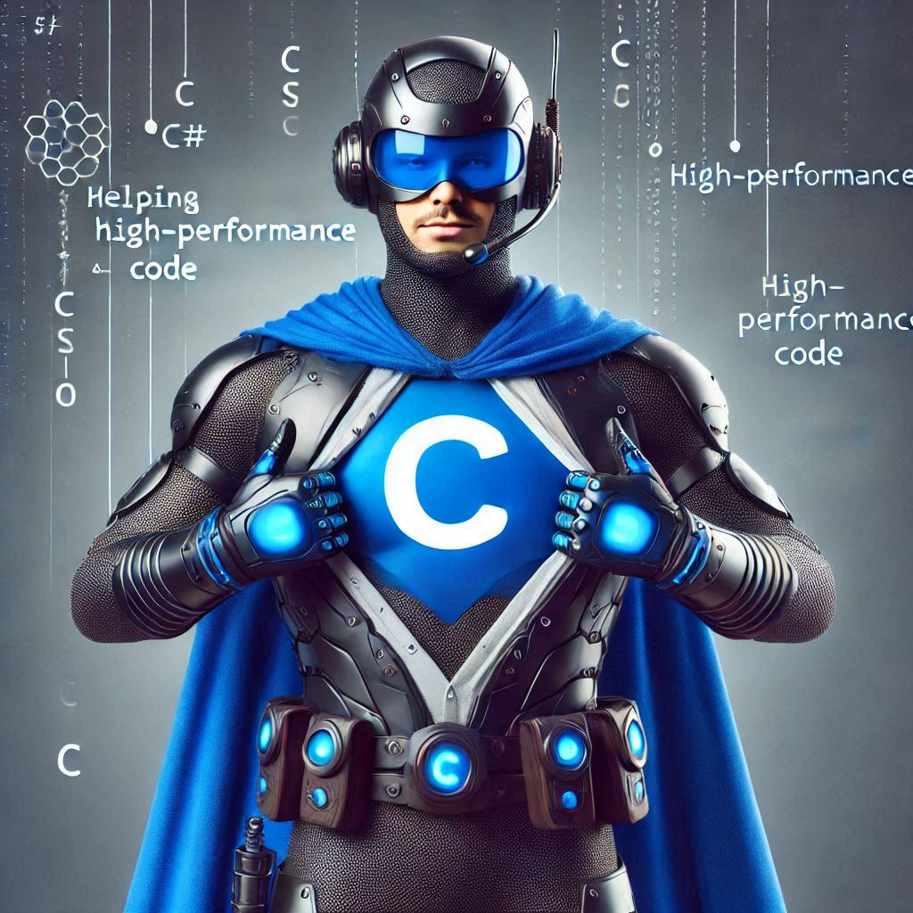

# DIO_LAB_AI900_COPILOT

[EN]

This repository is a laboratory that is part of the preparation course for Microsoft's AI-900, promoted by Digital Innovation One.  
Here, Microsoft's Copilot resource was used for image generation.

[Microsoft Copilot](https://copilot.microsoft.com/)

## _Steps_
The first step was to add a simple description for image generation: _create a superhero based on the C# programming language._

The generated image was the following:  

Then I added a negative comment that I didn’t like the image and improved the description: _I didn’t like this image. I will improve my description: create a superhero wearing blue clothes with the C# symbol on the chest and some details like technological gloves, a helmet, and special boots. This superhero is responsible for helping all programmers with their high-performance code._

The generated image:  

## _Result_
The result was as good as I expected, but I believe that a better description in the prompt can help achieve the desired outcome.

[FR]
Ce dépôt est un laboratoire faisant partie du cours de préparation pour l'examen AI-900 de Microsoft, organisé par Digital Innovation One.  
Ici, la ressource Copilot de Microsoft a été utilisée pour la génération d'images.

[Microsoft Copilot](https://copilot.microsoft.com/)

## _Étapes_
La première étape consistait à ajouter une description simple pour générer une image : _créez un super-héros basé sur le langage de programmation C#._

L'image générée était la suivante :  

Ensuite, j'ai ajouté un commentaire négatif indiquant que je n'aimais pas l'image et j'ai amélioré la description : _Je n'ai pas aimé cette image. Je vais améliorer ma description : créer un super-héros vêtu de bleu avec le symbole C# sur la poitrine et quelques détails comme des gants technologiques, un casque et des bottes spéciales. Ce super-héros est chargé d'aider tous les programmeurs avec leur code haute performance._

L'image générée :  

## _Résultat_
Le résultat était aussi bon que je l'espérais, mais je pense qu'une meilleure description dans le prompt pourrait aider à obtenir le résultat souhaité.
